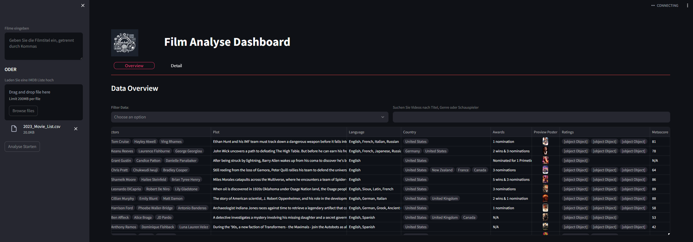
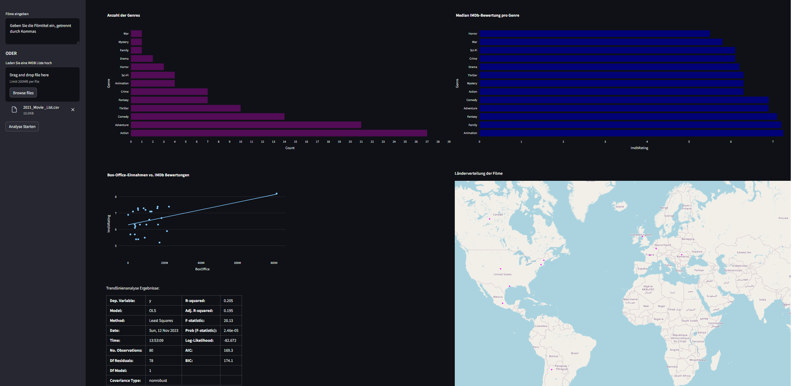
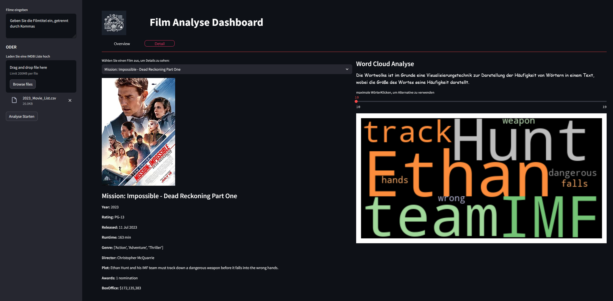

<h1>OMDB Movie Analysis Dashboard</h1>


<h2>Überblick</h2>
Diese Streamlit-App bietet eine interaktive Plattform zur Analyse von Filmdaten. Sie ermöglicht es Benutzern, Filmdaten basierend auf Titeln oder einer hochgeladenen Liste zu analysieren und bietet umfassende Einblicke in verschiedene Aspekte der Filme.

**Overview.py**



**Details.py**



### Hauptmerkmale

- **Datenaktualisierung**: Die App kann Filmdaten basierend auf eingegebenen Titeln oder einer hochgeladenen Datei aktualisieren und analysieren.
- **Übersichtsgrafiken**: Im Overview-Tab werden verschiedene Grafiken erstellt, die Einblicke in Genres, IMDb-Bewertungen, Box-Office-Einnahmen und die geografische Verteilung der Filme bieten.
- **Detailansichten**: Der Detail-Tab bietet tiefere Einblicke in einzelne Filme, einschließlich einer Wortwolkenanalyse des Plots.

<h3>Hauptfunktionen</h3>

**Filminformationen Abrufen:** 

Die App verwendet die OMDB API, um Daten zu einzelnen Filmen oder einer Liste von Filmen abzurufen.

**Datenvisualisierung:**

Visualisierung von Filmgenres, IMDb-Bewertungen, Box-Office-Einnahmen und mehr durch verschiedene Grafiktypen wie Balkendiagramme und Karten.

**Word Cloud Analyse:**

Visualisierung von Filmplots durch Wortwolken, um häufige Themen und Schlüsselwörter zu identifizieren.
Geo-Informationen: Anzeige der Herkunftsländer der Filme auf einer interaktiven Karte.

**Struktur der App**
<ul>
<li><strong>streamlit/config.toml:</strong>Konfigurationseinstellungen für den Streamlit-Server.</li>
<li><strong>api/extract_data.py:</strong> Modul zum Abrufen von Filmdaten von der OMDB API.</li>
<li><strong>design/styler.py:</strong> Hilfsklasse für benutzerdefinierte CSS-Stile und Designelemente.</li>
<li><strong>input/:</strong> Verzeichnis mit CSV-Dateien von IMDb für die Jahre 2021 und 2023.</li>
<li><strong>process/processor.py:</strong> Enthält die `DataProcessor`-Klasse zur Verarbeitung und Analyse der Filmdaten. Funktionen umfassen das Explodieren von Spalten, Verarbeiten von Bewertungen und Erstellen von geografischen Daten für Kartenvisualisierungen.</li>
<li><strong>static/img/logo.jpg: </strong> Logo der App.</li>
<li><strong>tab/overview.py:</strong> Erstellung der Überblicksgrafiken und -funktionen für das Dashboard.</li>
<li><strong>tab/details.py:</strong> Verantwortlich für die Erstellung der Detailansicht in der App. Beinhaltet Funktionen zur Erzeugung von Wortwolken und zur Anzeige detaillierter Filminformationen.</li>
<li><strong>app.py:</strong>  Hauptskript der Streamlit-App, das alle Module und Komponenten initialisiert.</li>
<li><strong>config.py:</strong> Konfigurationsklasse mit Pfaden und API-Schlüsseln.</li>
</ul>

**Setup und Ausführung**

Installieren Sie die notwendigen Abhängigkeiten über pip install -r requirements.txt. ODER pipenv install 
- Um die App auszuführen, benötigen Sie Python 3.11.3 und die im `Pipfile` angegebenen Pakete. Installieren Sie die Pakete mit Pipenv:
```bash
pipenv install
pipenv shell
streamlit run app.py
````
Führen Sie die App mit dem Befehl streamlit run app.py aus.
Die App ist nun im Browser unter der angegebenen URL zugänglich.
Hinweis
Die .env-Datei mit API-Zugangsdaten ist aus Sicherheitsgründen nicht im Repository enthalten.
Sie müssen Ihren eigenen API-Schlüssel von der OMDB API-Website anfordern (hier: <a href="https://www.omdbapi.com/apikey.aspx">OMDB-API KEY REQUEST</a>)
und diesen in Ihrer lokalen .env-Datei speichern.
Bsp: 

API_KEY=XXXX

**Datenquellen**
Die App verwendet IMDb-Daten, die in CSV-Dateien im input-Ordner enthalten sind. Beispielhafte Datenzeilen:


````matematica
Position,Const,Created,Modified,Description,Title,URL,Title Type,IMDb Rating,Runtime (mins),Year,Genres,Num Votes,Release Date,Directors
1,tt9032400,2020-04-24,Eternals,https://www.imdb.com/title/tt9032400/,movie,6.3,156,2021,"Action, Adventure, Fantasy, Sci-Fi",372217,2021-10-18,Chloé Zhao
...

````